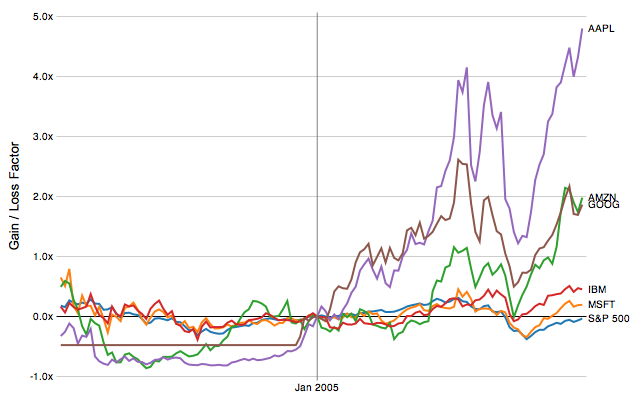
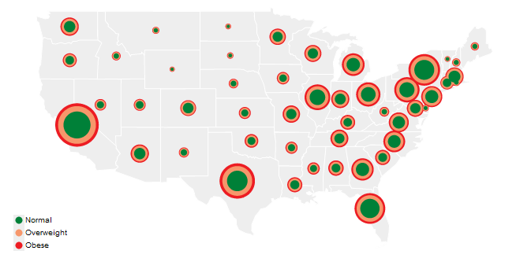

**Disclaimer**: I am NOT the author of this paper.
This is reproduced from <https://homes.cs.washington.edu/~jheer/files/zoo/>,
but with a Table of Contents and section links for easier referencing
(permission pending).

<!-- pasted from https://homes.cs.washington.edu/~jheer/files/zoo -->

<h1>A Tour Through the Visualization Zoo</h1>

<em>Jeffrey Heer, Michael Bostock, and Vadim Ogievetsky 
Stanford University</em>

## Table of Contents

* [Introduction](#introduction)
* [Time-Series Data](#time-series-data)
  * [Index Charts](#index-charts)
  * [Stacked Graphs](#stacked-graphs)
  * [Small Multiples](#small-multiples)
  * [Horizon Graphs](#horizon-graphs)
* [Statistical Distributions](#statistical-distributions)
  * [Stem-and-Leaf Plots](#stem-and-leaf-plots)
  * [Q-Q Plots](#q-q-plots)
  * [Scatter Plot Matrix (SPLOM)](#scatter-plot-matrix-splom)
  * [Parallel Coordinates](#parallel-coordinates)
* [Maps](#maps)
  * [Flow Maps](#flow-maps)
  * [Choropleth Maps](#choropleth-maps)
  * [Graduated Symbol Maps](#graduated-symbol-maps)
  * [Cartograms](#cartograms)
* [Hierarchies](#hierarchies)
  * [Node-Link Diagrams](#node-link-diagrams)
  * [Adjacency Diagrams](#adjacency-diagrams)
  * [Enclosure Diagrams](#enclosure-diagrams)
* [Networks](#networks)
  * [Force-Directed Layout](#force-directed-layout)
  * [Arc Diagrams](#arc-diagrams)
  * [Matrix Views](#matrix-views)
* [Conclusion](#conclusion)
  * [Additional Material](#additional-material)
  * [Visualization Development Tools](#visualization-development-tools)

<h2>Introduction</h2>

Thanks to advances in sensing, networking, and data management, our society is producing digital information at an astonishing rate. According to one estimate, in 2010 alone we will generate 1,200 exabytes &mdash; 60 million times the Library of Congress. Within this deluge of data lies a wealth of valuable information on how we conduct our businesses, governments, and personal lives. To put the information to good use, we must find ways to meaningfully explore, relate, and communicate the data.

The goal of visualization is to aid our understanding of data by leveraging the human visual system's highly-tuned ability to see patterns, spot trends, and identify outliers. Well-designed visual representations can replace cognitive calculations with simple perceptual inferences and improve comprehension, memory, and decision making. By making data more accessible and appealing, visual representations may also help engage more diverse audiences in exploration and analysis. The challenge is to create effective and engaging visualizations that are appropriate to the data.

Creating a visualization requires a number of nuanced judgments. One must determine which questions to ask, identify the appropriate data, and select effective <em>visual encodings</em> to map data values to graphical features such as position, size, shape, and color. The challenge is that for any given data set the number of visual encodings &mdash; and thus the space of possible visualization designs &mdash; is extremely large. To guide this process, computer scientists, psychologists, and statisticians have studied how well different encodings facilitate the comprehension of data types such as numbers, categories, and networks. For example, <em>graphical perception</em> experiments find that spatial position (as in a scatter plot or bar chart) leads to the most accurate decoding of numerical data, and is generally preferable to visual variables such as angle, 1D length, 2D area, 3D volume, and color saturation. Thus it should be no surprise that the most common data graphics, including bar charts, line charts, and scatter plots, use position encodings. However, our understanding of graphical perception remains incomplete, and must appropriately be balanced with interaction design and aesthetics.

In this article, we provide a brief tour through the "visualization zoo," showcasing techniques for visualizing and interacting with diverse data sets. In many situations, not only will simple data graphics suffice, they may be preferable. However, we will focus on a few of the more sophisticated and unusual techniques that have been developed to deal with complex data sets. After all, you don't go to the zoo to see chihuahuas and raccoons &mdash; you go to admire the majestic polar bear, the graceful zebra, and the terrifying Sumatran tiger. Analogously, we will cover some of the more exotic (but practically useful!) forms of visual data representation. We will start with one of the most common forms of data, time-series, continue on to statistical data and maps, and then complete the tour with hierarchies and networks. Along the way, bear in mind that all visualizations share a common "DNA" &mdash; a set of mappings between data properties and visual attributes such as position, size, shape, and color &mdash; and that customized species of visualization might always be constructed by varying these encodings.

Each visualization is accompanied by an interactive example: click the image to load the full visualization. The live examples were created using <strong><a href="http://protovis.org" title="Protovis">Protovis</a></strong>, an open-source language for web-based data visualization. To learn more about how a visualization was made (or to copy-and-paste it for your own use), simply "View Source" on the page. All example source code is released into the public domain, and has no restrictions on reuse or modification. However, please note that these examples will only work on a modern, standards-compliant browser supporting scalable vector graphics (SVG). Supported browsers include recent versions of Firefox, Safari, Chrome, and Opera. Unfortunately, Internet Explorer 8 and earlier do not support SVG and so can not be used to view the interactive examples.

<h2>Time-Series Data</h2>

Time-series &mdash; sets of values changing over time &mdash; are one of the most common forms of recorded data. Time-varying phenomena are central to many domains; finance (stock prices, exchange rates), science (temperatures, pollution levels, electric potentials), and public policy (crime rates) are just a few. One often needs to compare a large number of time-series simultaneously and can choose from a number of visualizations to do so.

<h3>Index Charts</h3>

With some forms of time-series data, raw values are less important than relative changes. Consider investors, who are more interested in a stock's growth rate than its specific price. Multiple stocks may have dramatically different baseline prices, but be meaningfully compared when normalized. An <em>index chart</em> is an interactive line chart that shows percentage changes for a collection of time-series based on a selected index point. For example, the image above shows the percentage change of selected stock prices if purchased in January 2005: one can see the rocky rise enjoyed by those who invested in Amazon, Apple, or Google at that time.

<h3>Stacked Graphs</h3>

Other forms of time-series data may be better seen in aggregate. By stacking area charts on top of each other, we arrive at a visual summation of time-series values &mdash; a <em>stacked graph</em>. Stacked graphs (sometimes called <em>stream graphs</em>) depict aggregate patterns and often support drill-down into a subset of individual series. The chart above shows the number of unemployed workers in the United States over the last decade, subdivided by industry. While such charts have proven popular in recent years, they do have some notable limitations. Stacked graphs do not support negative numbers and are meaningless for data that should not be summed (temperatures, for instance). Moreover, stacking may make it difficult to accurately interpret trends that lie atop other curves. Interactive search and filtering is often used to compensate for this problem.

<h3>Small Multiples</h3>

In lieu of stacking, multiple time-series can be plotted within the same axes, as in the index chart. However, placing multiple series in the same space may produce overlapping curves that reduce legibility. An alternative approach is to use <em>small multiples</em>: showing each series in its own chart. In this case we again see the number of unemployed workers, but normalized within each industry category. We can now more accurately see both overall trends and seasonal patterns in each sector. While we are currently considering time-series data, note that small multiples can be constructed for just about any type of visualization: bar charts, pie charts, maps, etc. This often produces a more effective visualization than trying to coerce all the data into single plot.

<h3>Horizon Graphs</h3>

However, what happens when you want to compare even more time-series at once? <em>Horizon graphs</em> are a technique for increasing the <em>data density</em> of a time-series view while preserving resolution. Consider the four charts shown here. The first graph is a standard area chart, with positive values colored blue and negative values colored red. The second graph "mirrors" negative values into the same region as positive values, doubling the data density of the area chart. The third chart &mdash; a horizon graph &mdash; doubles the data density yet again by dividing the chart into bands and layering the bands to create a nested form. The result is a chart that preserves data resolution, but uses only a quarter of the space. While horizon graphs take some time to learn, they have been found to be more effective than standard plots when the chart sizes get quite small.

<h2>Statistical Distributions</h2>

Other visualizations have been designed to reveal how a set of numbers are distributed and thus help an analyst better understand the statistical properties of the data. Analysts often want to fit their data to statistical models, either to test hypotheses or predict future values. However, an improper choice of model can lead to faulty predictions. Thus one important use of visualizations is <em>exploratory data analysis</em>: gaining insight into how data are distributed to inform data transformation and modeling decisions. Common techniques include <em>histograms</em>, which show the prevalence of values grouped into bins, and <em>box-and-whisker</em> plots, which can convey statistical features such as the mean, median, quartile boundaries, or extreme outliers. However, a number of other techniques exist for assessing a distribution and examining interactions between multiple dimensions.

<h3>Stem-and-Leaf Plots</h3>

When assessing a collection of numbers, one alternative to the histogram is the <em>stem-and-leaf plot</em>. The plot typically bins numbers according to their first significant digit, and then stacks the values within each bin by the second significant digit. This minimalistic representation uses the data itself to paint a frequency distribution, replacing the "information-empty" bars of a traditional histogram bar chart and allowing one to assess both the overall distribution and the contents of each bin. Here, the stem-and-leaf plot shows the distribution of completion rates of workers completing crowdsourced tasks on Amazon's Mechanical Turk. Note the multiple clusters: one group clusters around high levels of completion (99-100%); at the other extreme is a cluster of Turkers who complete only a few tasks (~10%) in a group.

<h3>Q-Q Plots</h3>

While histograms and stem-and-leaf plots are one common tools for assessing a frequency distribution, <em>quantile-quantile (or Q-Q) plots</em> are a more powerful tool. Q-Q plots compare two probability distributions by graphing their <a href="http://en.wikipedia.org/wiki/Quantile" title="Wikipedia: Quantile">quantiles</a> against each other. If the two are similar, the plotted values will roughly lie along the central diagonal. If the two are linearly related, values will again lie along a line, though with varying slope and intercept. Here we show the same Mechanical Turk participation data compared to three statistical distributions. Note how the data forms three distinct components when compared to uniform and normal (Gaussian) distributions: this suggests that a statistical model with three components might be more appropriate, and indeed we see in the final plot that a fitted mixture of three normal distributions provides a better fit. While powerful, one obvious limitation of Q-Q plots is that their effective use requires that viewers possess some statistical know-how.

<h3>Scatter Plot Matrix (SPLOM)</h3>

Other visualization techniques attempt to represent the relationships among multiple variables. Multivariate data occurs very frequently and is notoriously hard to represent, due in part to the difficulty of mentally picturing data in more than three dimensions. One technique to overcome this problem is use small multiples of scatter plots showing a set of pairwise relations among variables; thus creating the <em>scatter plot matrix</em> (or <em>SPLOM</em>). SPLOMs enable visual inspection of correlations between any pair of variables. Here we use a scatter plot matrix to visualize the attributes of a database of automobiles, showing the relationships between horsepower, weight, acceleration, and displacement. Additionally, interaction techniques such as <em>brushing-and-linking</em> &mdash; in which a selection of points on one graph highlights the same points on all the other graphs &mdash; can be used to explore patterns within the data.

<h3>Parallel Coordinates</h3>

<em>Parallel coordinates</em> (<em>||-coord</em>) take a different approach to visualizing multivariate data. Instead of graphing every pair of variables in two dimensions, we repeatedly plot the data on parallel axes and then connect the corresponding points with lines. Each poly-line represents a single row in the database and line crossings between dimensions often indicate inverse correlation. Re-ordering dimensions can aid pattern-finding, as can interactive querying to filter along one more dimensions. Another advantage of parallel coordinates is that they are relatively compact and so many variables can be shown simultaneously.

<h2>Maps</h2>

While maps may seem a natural way to visualize geographical data, they have a long and rich history of design. Many maps are based upon a <em>cartographic projection</em>: a mathematical function that maps the 3D geometry of the Earth to a 2D image. Other maps knowingly distort or abstract geographic features to tell a richer story or highlight specific data.

<h3>Flow Maps</h3>

By placing stroked lines on top of a geographic map, a <em>flow map</em> can depict the movement of a quantity in space and (implicitly) in time. Flow lines typically encode a large amount of multivariate information: path points, direction, line thickness, and color can all be used to present dimensions of information to the viewer. Here we see a modern interpretation of Charles Minard's depiction of Napoleon's ill-fated march on Moscow. Many of the greatest flow maps also involve subtle uses of distortion, as geography is bended to accommodate or highlight flows.

<h3>Choropleth Maps</h3>

Data is often collected and aggregated by geographical areas such as states. A standard approach to communicating this data is to use a color encoding of the geographic area, resulting in a <em>choropleth map</em>. Here, we use a color encoding to communicate the prevalence of obesity in each U.S. state. Though this is a widely used visualization technique, some care is required. One common error is to encode raw data values (such as population) rather than using normalized values to produce a density map. Another issue is that one's perception of the shaded value can also be affected by the underlying area of the geographic region.

<h3>Graduated Symbol Maps</h3>

An alternative to choropleth maps is the <em>graduated symbol map</em>, which instead places symbols over an underlying map. This approach avoids confounding geographic area with data values and allows for more dimensions to be visualized (e.g., symbol size, shape, and color). In addition to simple shapes like circles, graduated symbol maps may use more complicated glyphs such as pie charts. Here total circle size represents a state's population, and each ring indicates the proportion of people with a specific Body Mass Index rating.

<h3>Cartograms</h3>

<em>Cartograms</em> distort the shape of geographic regions so that the area directly encodes a data variable. A common example is to redraw every country in the world sizing it proportionally to population or GDP. Many types of cartograms have been created; in this example we use the <em>Dorling cartogram</em>, which represents each geographic region with a sized circle, placed so as to resemble the true geographic configuration. Here circular area encodes the total number of obese people per state and color encodes the percentage of the total population that is obese.

<h2>Hierarchies</h2>

While some data are simply a flat collection of numbers, most data can be organized into natural hierarchies. Consider: spatial entities, such as counties, states and countries; command structures for businesses and governments; software packages and phylogenetic trees. Even for data with no apparent hierarchy, statistical methods (e.g., k<em>-means clustering</em>) may be applied to organize data empirically. Special visualization techniques exist to leverage hierarchical structure, allowing rapid multi-scale inferences: micro-observations of individual elements and macro-observations of large groups.

<h3>Node-Link Diagrams</h3>

The word "tree" is used interchangeably with "hierarchy", as the fractal branches of an oak might mirror the nesting of data. If we take a two-dimensional blueprint of a tree, we have a popular choice for visualizing hierarchies: a <i>node-link diagram</i>. Many different tree layout algorithms have been designed; the Reingold-Tilford algorithm, used above on a package hierarchy of software classes, produces a tidy result with minimal wasted space.

An alternative visualization scheme is the <i>dendrogram</i> (or "cluster") algorithm, which places leaf nodes of the tree at the same level. Thus in the diagram above, the classes (orange leaf nodes) are on the diameter of the circle, with the packages (blue internal nodes) inside. Using polar rather than Cartesian coordinates has a pleasing aeshetic, while using space more efficiently.

We would be amiss to overlook indented trees, used ubiquitously by operating systems to represent file directories, among other applications. While indented trees require excessive vertical space and do not facilitate multi-scale inferences, they do allow efficient <i>interactive</i> exploration of the tree to find a specific node. In addition, they allow rapid scanning of node labels, and multivariate data such as file sizes can be displayed adjacent to the hierarchy.

<h3>Adjacency Diagrams</h3>

<em>Adjacency diagrams</em> are space-filling variants of node-link diagrams; rather than drawing a link between parent and child in the hierarchy, nodes are drawn as solid areas (either arcs or bars), and their placement relative to adjacent nodes reveals their position in the hierarchy. The above "icicle" layout is similar to the first node-link diagram, in that the root node appears at the top, with child nodes underneath. However, because the nodes are now space-filling, we can use a length encoding for the size of software classes and packages. This reveals an additional dimension that would be difficult to show in a node-link diagram.

The "sunburst" layout is equivalent to the "icicle" layout, but in polar coordinates. Both are implemented using a "partition" layout, which can also generate node-link diagrams. Similarly, the previous "cluster" layout can be used to generated space-filling adjacency diagrams in either Cartesian or polar coordinates.

<h3>Enclosure Diagrams</h3>

<i>Enclosure diagrams</i> are also space-filling, using containment rather than adjacency to represent the hierarchy. Introduced by Ben Shneiderman in 1991, a <i>treemap</i> recursively subdivides area into rectangles. As with adjacency diagrams, the size of any node in the tree is quickly revealed. The above example uses padding (in blue) to emphasize enclosure; an alternative saturation encoding is sometimes used. <i>Squarified</i> treemaps use approximately-square rectangles, which offer better readability and size estimation than a naive "slice-and-dice" subdivision. Fancier algorithms such as Voronoi and jigsaw treemaps also exist, but are less common.

By packing circles instead of subdividing rectangles, we can produce a different sort of enclosure diagram that has an almost organic appearance. While it does not use space as efficiently as a treemap, the "wasted space" of <i>circle-packing layouts</i> effectively reveals the hierarchy. At the same time, node sizes can be rapidly compared using area judgments.

<h2>Networks</h2>

In addition to organization, one aspect of data that we may wish to explore through visualization is relationship. For example, given a social network, who is friends with whom? Who are the central players? What cliques exist? Who, if anyone, serves as a bridge between disparate groups? Abstractly, a hierarchy is a specialized form of network: each node has exactly one link to its parent, while the root node has no links. Thus node-link diagrams are also used to visualize networks, but the loss of hierarchy means a different algorithm is required to position nodes.

Mathematicians use the formal term "graph" to describe a network. A central challenge in graph visualization is computing an effective layout. Layout techniques typically seek to position closely-related nodes (in terms of <i>graph distance</i>, such as the number of links between nodes, or other metrics) close in the drawing; critically, <i>unrelated</i> nodes must also be placed far enough apart to differentiate relationships. Some techniques may seek to optimize other visual features, for example by minimizing the number of edge crossings.

<h3>Force-Directed Layout</h3>

A common and intuitive approach to network layout is to model the graph as a physical system: nodes are charged particles that repel each other, while links are dampened springs that pull related nodes together. A physical simulation of these forces then determines the node positions; approximation techniques that avoid computing all pairwise forces enable the layout of large numbers of nodes. In addition, interactivity allows the user to direct the layout and jiggle nodes to disambiguate links. These <i>force-directed layouts</i> are a good starting point for understanding the structure of a general undirected graph. Here we use a force-directed layout to view the network of character co-occurrence in the chapters of Victor Hugo's classic novel, Les Mis&eacute;rables. Node colors depict cluster memberships computed by a community detection algorithm.

<h3>Arc Diagrams</h3>

An <i>arc diagram</i> uses a one-dimensional layout of nodes, with circular arcs to represent links. While arc diagrams may not convey the overall structure of the graph as effectively as a two-dimensional layout, with a good ordering of nodes it is easy to identify cliques and bridges. And, as with the indented tree layout, multivariate data can easily be displayed alongside nodes. The problem of sorting the nodes in a manner that reveals underlying cluster structure is formally called <i>seriation</i>, and has diverse applications in visualization, statistics, and even archaeology!

<h3>Matrix Views</h3>

Mathematicians and computer scientists often think of a graph in terms of its <i>adjacency matrix</i>: each value in row <i>i</i> and column <i>j</i> in the matrix corresponds to the link from node <i>i</i> to node <i>j</i>. Given this representation, an obvious visualization then is: just show the matrix! Using color or saturation instead of text allows values associated with the links to be perceived more rapidly. The seriation problem applies just as much to <i>matrix views</i> as arc diagrams, so the order of rows and columns is important: here we use the groupings generated by a community detection algorithm to order the display. While path-following is harder in a matrix view than in a node-link diagram, matrices have a number of compensating advantages. As networks get large and highly-connected, node-link diagrams often devolve into giant hairballs of line crossings. However, in matrix views line crossings are impossible and with an effective sorting one quickly can spot clusters and bridges. Allowing interactive grouping and reordering of the matrix facilitates even deeper exploration of network structure.

<h2>Conclusion</h2>

We have now arrived at the end of our tour, and hope that the reader has found examples both intriguing and practical. Though we have visited a number of visual encoding and interaction techniques, many more species of visualization exist in the wild, and others await discovery. Emerging domains such as bioinformatics and text visualization are driving researchers and designers to continually formulate new, creative representations or find more powerful ways to apply the classics. In either case, the "DNA" underlying all visualizations remains the same: the principled mapping of data variables to visual features such as position, size, shape, and color. As you leave the zoo and head back into the wild, see if you can deconstruct the various visualizations crossing your path. Can you do better?

<h3>Additional Material</h3>

Want to learn more? You may enjoy these books:

<ul>
<li>Few, Stephen. Now I See It: Simple Visualization Techniques for Quantitative Analysis. Analytics Press, 2009.</li>
<li>Tufte, Edward. The Visual Display of Quantitative Information. Graphics Press, 1983.</li>
<li>Tufte, Edward. Envisioning Information. Graphics Press, 1990.</li>
<li>Ware, Colin. Visual Thinking for Design. Morgan Kaufmann, 2008.</li>
<li>Wilkinson, Leland. The Grammar of Graphics. Springer, 1999.</li>
</ul>

<h3>Visualization Development Tools</h3>

Want to program your own visualizations? Try one of these open source tools:

<ul>
<li><a href="http://protovis.org">Protovis</a> - a JavaScript tool for web-based visualization.</li>
<li><a href="http://processing.org">Processing</a> - a popular language and IDE for graphics and interaction.</li>
<li><a href="http://prefuse.org">Prefuse</a> - a Java API for information visualization.</li>
<li><a href="http://flare.prefuse.org">Prefuse Flare</a> - an ActionScript 3 library for data visualization in the Adobe Flash Player.</li>
<li><a href="http://vtk.org">The Visualization Toolkit</a> - a library for 3D and scientific visualization.</li>
</ul>
